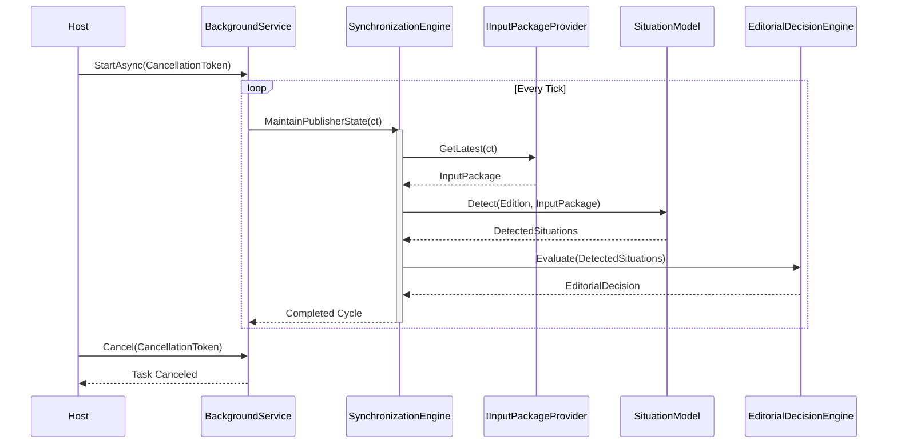

# Runtime Execution Architecture Blueprint

## 1. Runtime Responsibilities
The Publisher Runtime is responsible for driving the lifecycle of the business domain without leaking infrastructure concepts into it. Its primary responsibilities include:
- Establishing a continuous, non-blocking execution loop.
- Retrieving new stimuli (`InputPackage`) via providers.
- Passing data through the pure deterministic logic pipeline (`SituationModel`, `EditorialDecisionEngine`).
- Synchronizing side-effects via appropriate channels.
- Providing robust lifecycle management (Startup, Shutdown, Cancellation).

## 2. Execution Lifecycle
The execution lifecycle represents a continuous polling or event-driven loop running asynchronously:
- **Idle State**: Waiting for a scheduled tick or event trigger.
- **Acquisition State**: Pulling the latest `InputPackage` and the current `Edition` state.
- **Evaluation State**: Supplying the state and package to the `SituationModel` and subsequent models.
- **Synchronization State**: Applying reasoned decisions to artifacts and dispatching them.
- **Completion State**: Returning to Idle State until the next tick.

## 3. Startup Sequence
1. The Generic `Host` initializes the Dependency Injection container.
2. Background services (`IHostedService`) are started by the Host.
3. The designated background loop hooks into the `CancellationToken` and begins its continuous execution cycle.
4. The first cycle triggers an immediate `SynchronizationEngine.MaintainPublisherState()` invocation.

## 4. Shutdown Sequence
1. The `Host` receives a termination signal (e.g., SIGTERM, Ctrl+C).
2. The `CancellationTokenSource` is cancelled.
3. The background loop detects the cancellation token during its next await or check.
4. `SynchronizationEngine` allows the current deterministic cycle to finish gracefully (or aborts safely if stateless) and prevents new cycles from starting.
5. `Host` resources are disposed, and the process exits.

## 5. Component Interaction
Interactions are strictly unidirectional (top-down):
- `BackgroundService` calls `SynchronizationEngine`.
- `SynchronizationEngine` queries `IInputPackageProvider` and `IEditionRepository`.
- `SynchronizationEngine` passes state to `SituationModel`.
- `SituationModel` returns `DetectedSituation`s.
- `SynchronizationEngine` passes `DetectedSituation`s to Future Evaluation Models.

## 6. Exact Responsibilities
- **Host**: Configures the environment, builds DI, and manages the OS process lifecycle.
- **SynchronizationEngine**: The orchestrator. Coordinates data flow between state providers (`IEditionRepository`, `IInputPackageProvider`) and pure models, managing the boundaries of the execution cycle.
- **IInputPackageProvider**: A port that abstracts the mechanism of retrieving the latest raw stimuli.
- **SituationModel**: A pure, deterministic function mapping state and input to `DetectedSituation` enumerations.
- **Future Evaluation Model (EditorialDecisionEngine)**: A pure, deterministic function mapping detected situations and metadata into explicit actionable `EditorialDecision` objects.

## 7. Required Runtime Interfaces
- `IHostedService` (Framework interface for background worker).
- `ISynchronizationEngine`: `void MaintainPublisherState(CancellationToken ct);` (Updated for cancellation).
- `IInputPackageProvider`: `InputPackage GetLatest(CancellationToken ct);`

## 8. Minimal Background Execution Loop
The minimal execution loop will be a standard `.NET BackgroundService` that:
1. `await Task.Delay(interval, stoppingToken)`
2. `engine.MaintainPublisherState(stoppingToken)`
3. Repeats until `stoppingToken.IsCancellationRequested`.

## 9. Error Handling Strategy
- **Isolation**: Exceptions in the data extraction (`IInputPackageProvider`) do not crash the host; they merely abort the current cycle and log an error.
- **Idempotency**: Because all evaluation is deterministic and state modifications are atomic, a failed cycle can be retried cleanly on the next tick.
- **Logging**: All unexpected infrastructure exceptions are logged at the `BackgroundService` layer. Domain validation errors are logged at the `SynchronizationEngine` layer.

## 10. CancellationToken Propagation
The `CancellationToken` provided by the Host `ExecuteAsync` method will be propagated downward into the `SynchronizationEngine`, `IInputPackageProvider`, and any IO-bound dependencies to ensure prompt shutdown. Pure models (`SituationModel`) do not require cancellation tokens as they execute synchronously and deterministically.

## 11. Dependency Graph
```text
Host
L-- SynchronizationWorker (BackgroundService)
    L-- ISynchronizationEngine (Implementation: SynchronizationEngine)
        +-- IInputPackageProvider
        +-- IEditionRepository
        +-- ISituationModel
        L-- IEditorialDecisionEngine
```

## 12. Sequence Diagram

