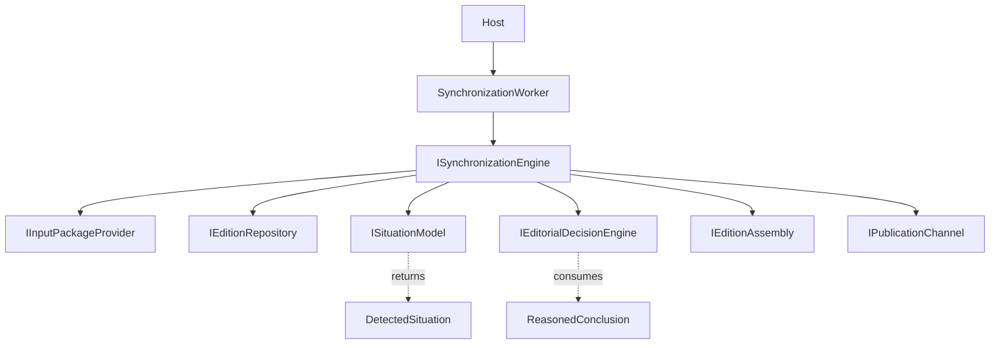
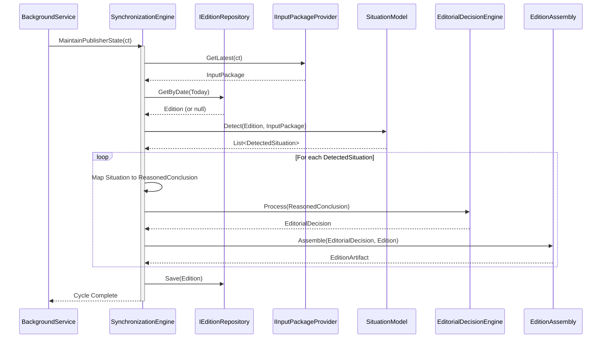

# Runtime Execution Architecture v2

## 1. Final Runtime Lifecycle

The definitive, event-free deterministic execution lifecycle of the Publisher is:

`Program`
v
`Host` (Configures DI, registers Worker)
v
`Runtime loop` (BackgroundService delay tick)
v
`SynchronizationEngine` (Orchestrates the cycle)
v
`SituationModel` (Evaluates state/input > returns `DetectedSituation`)
v
`Situation-to-Conclusion Mapping` (Translates `DetectedSituation` > `ReasonedConclusion`)
v
`EditorialDecisionEngine` (Translates `ReasonedConclusion` > `EditorialDecision`)
v
`Publication generation` (Edition Assembly / Graphic Assembly based on Decision)
v
`Synchronization` (Dispatching artifacts to external channels)
v
`Sleep` (Delay until next tick)

---

## 2. Resolving Conflicts from Blueprint Validation

### Conflict 1: `EditorialDecisionEngine` Interface Mismatch
**Problem**: `SituationModel` outputs `DetectedSituation`, but `EditorialDecisionEngine` expects `ReasonedConclusion`.
**Why it arose**: The Blueprint initially assumed `EditorialDecisionEngine` would directly process situations, ignoring the P1/P2 `ReasonedConclusion` text-based evaluation layer.
**Final Solution**: Do not modify `EditorialDecisionEngine`. Introduce a deterministic mapping phase inside `SynchronizationEngine` (or a dedicated pure Mapper) that translates each `DetectedSituation` enum into the corresponding `ReasonedConclusion` string format (e.g., `Situation.CleanupStarted` > `Evaluation: "CLEANUP"`).

### Conflict 2: Missing `CancellationToken` Support
**Problem**: The existing `ISynchronizationEngine` and `IInputPackageProvider` lack cancellation support.
**Why it arose**: Previous phases focused on pure domain modelling without infrastructure lifecycle considerations.
**Final Solution**: Extend the method signatures of `MaintainPublisherState(CancellationToken)` and `GetLatest(CancellationToken)`. This does not violate Clean Architecture as `CancellationToken` is a standard BCL primitive, not an infrastructure dependency.

---

## 3. `EditorialDecisionEngine` Necessity

**Is `EditorialDecisionEngine` actually needed?**
Yes. `ReasonedConclusion` is essentially a string-based intermediate representation (`Evaluation: "SIGNIFICANT (CHANGED CONTENT)"`). It does not represent a strict programmatic instruction. 
`EditorialDecisionEngine` serves the critical responsibility of parsing that textual conclusion into a strict struct (`EditorialDecision` containing the `DecisionResult` enum and `Classification`). It acts as the rigid barrier preventing text-based evaluation strings from leaking into the physical assembly (generation) layer.

---

## 4. CancellationToken Propagation Scheme

```text
[Host] (SIGTERM/Ctrl+C triggers application shutdown)
  v
  (Cancels ApplicationStopping Token)
  v
[SynchronizationWorker] (BackgroundService)
  v
  (Passes token to tick cycle)
  v
[SynchronizationEngine.MaintainPublisherState(ct)]
  v
  (Passes token to IO-bound providers)
  v
[IInputPackageProvider.GetLatest(ct)] & [IEditionRepository.Save(ct)]
```
*(Pure domain models like `SituationModel` and `EditorialDecisionEngine` do not receive the token as they are synchronous and CPU-bound).*

---

## 5. Active Edition Retrieval

**Analysis of `IEditionRepository`**:
The existing repository provides:
- `GetById(Guid id)`
- `GetByDate(DateOnly targetDate)`
- `Save(Edition edition)`

**Solution**:
No new API is required. The `Runtime` operates in the present. The `SynchronizationEngine` will simply invoke `GetByDate(DateOnly.FromDateTime(DateTime.UtcNow))`. If it returns an `Edition`, that is the active state. If it returns null, the engine knows it must initiate the `MorningStartup` sequence to construct today's `Edition`.

---

## 6. Dependency Graph



---

## 7. Sequence Diagram



---

## 8. Engineering Checkpoints

- **Що вже реалізовано (Implemented)**:
  - `ISituationModel` & `SituationModel` (частково)
  - `EditorialDecisionEngine`
  - `IEditionRepository`
  - Domain aggregates (`Edition`, `Publication`)

- **Що потребує реалізації (To Be Implemented)**:
  - `SynchronizationWorker` (HostedService)
  - `SynchronizationEngine.MaintainPublisherState()` логіка орхестрації
  - Мапінг `DetectedSituation` -> `ReasonedConclusion`
  - Додавання `CancellationToken` до існуючих інтерфейсів

- **Що заблоковано ADR (Blocked by ADR)**:
  - Реалізація порівняння адрес, територій, графіків та хешів у `SituationModel` (ADR-004)
  - Створення нових властивостей (`CreatedAt`, `ContentHash`) у `Publication` (ADR-004)

- **Що готове до кодування (Ready for Implementation)**:
  - Реєстрація `SynchronizationWorker` у Host.
  - Оновлення сигнатур `ISynchronizationEngine` та `IInputPackageProvider`.
  - Реалізація `SynchronizationEngine` з підтримкою розблокованих ситуацій (S-01, S-11, S-12, S-14, S-15, S-16).

